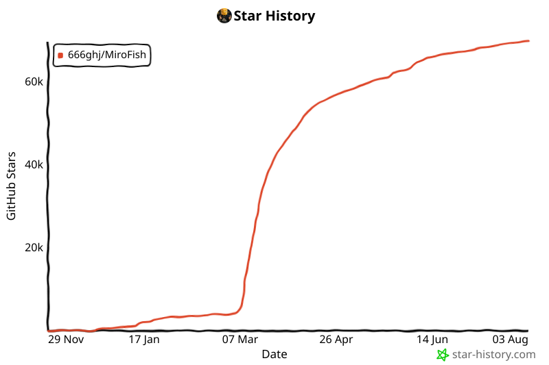

# MiroFish-Autopilot

> **A production-hardened fork of [666ghj/MiroFish](https://github.com/666ghj/MiroFish): submit jobs, walk away, come back to finished reports.**
> 上游 MiroFish 的生产加固分支：提交任务即可离开，回来直接拿报告。

Stock MiroFish runs one simulation while you babysit each step. This fork runs itself:

### 🚦 Job queue · 任务队列
- **1 running + 2 queued**, FIFO auto-promotion — submit up to 3 jobs and close the browser tab
- Instant job cards with live stage badges (排队中 / 准备中 / 运行中 / 失败), survive refresh, restarts and redeploys
- The launch button doubles as a live queue indicator (加入队列 / 队列已满); deleting a job **cancels all of its server-side work within seconds** — zero orphaned LLM spend
- A job counts as done only when its report is **downloadable**; agent interviews run against the *live* simulation during report writing

### 💰 Cost governance · 成本治理
- **思考深度 (think level)**: economy mode halves simulation-agent reasoning tokens (MiniMax-validated)
- **Round cap** (`MAX_SIM_HOURS`, default 72) and **activation cap** (`MAX_AGENTS_PER_HOUR`, default 8) — the config LLM can no longer silently pick a 2× costlier simulation
- Graph reuse: resubmitting the same document + prompt skips ontology + Zep graph build entirely
- Rate-limit-aware retries: transient 429s back off; plan-quota exhaustion fails fast with the real reason on the card

### 🛡️ Self-healing ops · 自愈运维
- **Watchdog** auto-stops runs wedged at the finish line (held-open processes can't freeze the queue overnight)
- **Boot auto-restore**: the Space's ephemeral disk repopulates from the newest HF-dataset backup on every container start — random Hugging Face restarts no longer wipe your history
- **Deploy guard**: deploys refuse to run while any simulation, build, prepare or report is in flight; data is backed up before and restored after every deploy
- Nightly backups to a private HF dataset; post-merge guard-rail tests keep upstream merges from silently reverting any of the above

### 🔀 Model switching · 模型切换
- Deployment-level toggle between **MiniMax M3** and **DeepSeek V4 Pro** — flip providers when one hits its quota, mid-day, without redeploying

All upstream features and design are preserved — full credit to the original authors below.
本分支保留上游全部功能与设计，原始项目与作者见下文。

---

<div align="center">


<a href="https://trendshift.io/repositories/16144" target="_blank"></a>

简洁通用的群体智能引擎，预测万物
</br>
<em>A Simple and Universal Swarm Intelligence Engine, Predicting Anything</em>

<a href="https://www.shanda.com/" target="_blank"></a>

[](https://github.com/666ghj/MiroFish/stargazers)
[](https://github.com/666ghj/MiroFish/watchers)
[](https://github.com/666ghj/MiroFish/network)
[](https://hub.docker.com/)
[](https://deepwiki.com/666ghj/MiroFish)

[](http://discord.gg/ePf5aPaHnA)
[](https://x.com/mirofish_ai)
[](https://www.instagram.com/mirofish_ai/)

[English](./README.md) | [中文文档](./README-ZH.md)

</div>

## ⚡ Overview

**MiroFish** is a next-generation AI prediction engine powered by multi-agent technology. By extracting seed information from the real world (such as breaking news, policy drafts, or financial signals), it automatically constructs a high-fidelity parallel digital world. Within this space, thousands of intelligent agents with independent personalities, long-term memory, and behavioral logic freely interact and undergo social evolution. You can inject variables dynamically from a "God's-eye view" to precisely deduce future trajectories — **rehearse the future in a digital sandbox, and win decisions after countless simulations**.

> You only need to: Upload seed materials (data analysis reports or interesting novel stories) and describe your prediction requirements in natural language</br>
> MiroFish will return: A detailed prediction report and a deeply interactive high-fidelity digital world

### Our Vision

MiroFish is dedicated to creating a swarm intelligence mirror that maps reality. By capturing the collective emergence triggered by individual interactions, we break through the limitations of traditional prediction:

- **At the Macro Level**: We are a rehearsal laboratory for decision-makers, allowing policies and public relations to be tested at zero risk
- **At the Micro Level**: We are a creative sandbox for individual users — whether deducing novel endings or exploring imaginative scenarios, everything can be fun, playful, and accessible

From serious predictions to playful simulations, we let every "what if" see its outcome, making it possible to predict anything.

## 🌐 Live Demo

Welcome to visit our online demo environment and experience a prediction simulation on trending public opinion events we've prepared for you: [mirofish-live-demo](https://666ghj.github.io/mirofish-demo/)

## 📸 Screenshots

<div align="center">
<table>
<tr>
<td></td>
<td></td>
</tr>
<tr>
<td></td>
<td></td>
</tr>
<tr>
<td></td>
<td></td>
</tr>
</table>
</div>

## 🎬 Demo Videos

### 1. Wuhan University Public Opinion Simulation + MiroFish Project Introduction

<div align="center">
<a href="https://www.bilibili.com/video/BV1VYBsBHEMY/" target="_blank"></a>

Click the image to watch the complete demo video for prediction using BettaFish-generated "Wuhan University Public Opinion Report"
</div>

### 2. Dream of the Red Chamber Lost Ending Simulation

<div align="center">
<a href="https://www.bilibili.com/video/BV1cPk3BBExq" target="_blank"></a>

Click the image to watch MiroFish's deep prediction of the lost ending based on hundreds of thousands of words from the first 80 chapters of "Dream of the Red Chamber"
</div>

> **Financial Prediction**, **Political News Prediction** and more examples coming soon...

## 🔄 Workflow

1. **Graph Building**: Seed extraction & Individual/collective memory injection & GraphRAG construction
2. **Environment Setup**: Entity relationship extraction & Persona generation & Agent configuration injection
3. **Simulation**: Dual-platform parallel simulation & Auto-parse prediction requirements & Dynamic temporal memory updates
4. **Report Generation**: ReportAgent with rich toolset for deep interaction with post-simulation environment
5. **Deep Interaction**: Chat with any agent in the simulated world & Interact with ReportAgent

## 🚀 Quick Start

### Option 1: Source Code Deployment (Recommended)

#### Prerequisites

| Tool | Version | Description | Check Installation |
|------|---------|-------------|-------------------|
| **Node.js** | 18+ | Frontend runtime, includes npm | `node -v` |
| **Python** | ≥3.11, ≤3.12 | Backend runtime | `python --version` |
| **uv** | Latest | Python package manager | `uv --version` |

#### 1. Configure Environment Variables

```bash
# Copy the example configuration file
cp .env.example .env

# Edit the .env file and fill in the required API keys
```

**Required Environment Variables:**

```env
# LLM API Configuration (supports any LLM API with OpenAI SDK format)
# Recommended: Alibaba Qwen-plus model via Bailian Platform: https://bailian.console.aliyun.com/
# High consumption, try simulations with fewer than 40 rounds first
LLM_API_KEY=your_api_key
LLM_BASE_URL=https://dashscope.aliyuncs.com/compatible-mode/v1
LLM_MODEL_NAME=qwen-plus

# Zep Cloud Configuration
# Free monthly quota is sufficient for simple usage: https://app.getzep.com/
ZEP_API_KEY=your_zep_api_key
```

#### 2. Install Dependencies

```bash
# One-click installation of all dependencies (root + frontend + backend)
npm run setup:all
```

Or install step by step:

```bash
# Install Node dependencies (root + frontend)
npm run setup

# Install Python dependencies (backend, auto-creates virtual environment)
npm run setup:backend
```

#### 3. Start Services

```bash
# Start both frontend and backend (run from project root)
npm run dev
```

**Service URLs:**
- Frontend: `http://localhost:3000`
- Backend API: `http://localhost:5001`

**Start Individually:**

```bash
npm run backend   # Start backend only
npm run frontend  # Start frontend only
```

### Option 2: Docker Deployment

```bash
# 1. Configure environment variables (same as source deployment)
cp .env.example .env

# 2. Pull image and start
docker compose up -d
```

Reads `.env` from root directory by default, maps ports `3000 (frontend) / 5001 (backend)`

> Mirror address for faster pulling is provided as comments in `docker-compose.yml`, replace if needed.

## 📬 Join the Conversation

<div align="center">

</div>

&nbsp;

The MiroFish team is recruiting full-time/internship positions. If you're interested in multi-agent simulation and LLM applications, feel free to send your resume to: **mirofish@shanda.com**

## 📄 Acknowledgments

**MiroFish has received strategic support and incubation from Shanda Group!**

MiroFish's simulation engine is powered by **[OASIS (Open Agent Social Interaction Simulations)](https://github.com/camel-ai/oasis)**, We sincerely thank the CAMEL-AI team for their open-source contributions!

## 📈 Project Statistics

<a href="https://github.com/666ghj/MiroFish">
 <picture>
   <source media="(prefers-color-scheme: dark)" srcset="static/image/star-history-dark.svg" />
   <source media="(prefers-color-scheme: light)" srcset="static/image/star-history-light.svg" />
   
 </picture>
</a>
